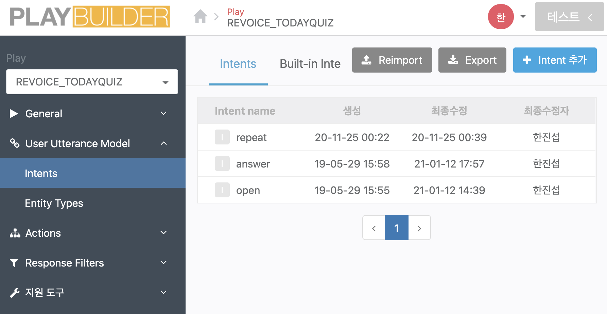
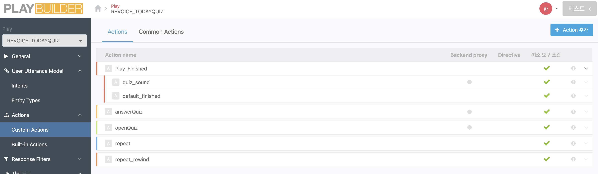

# 오늘의 퀴즈 - Display.ver(21.03.23)


## 개요


SKT NUGU Play로 서비스 중인 오늘의 퀴즈 Display버전입니다.

T전화로 서비스 확장 요청을 받아 Display interface기능을 업데이트했습니다.  

T전화에서는 처음으로 제공되는 3rd party Play입니다.


### Intent




사용자의 발화를 구분하는 Intent입니다. 오늘의 퀴즈는 3개의 intent를 사용합니다.

1. open - 퀴즈시작 발화 (퀴즈 시작해줘, 알려줘 등 )
2. answer - 정답 발화 (3번, 정답 4번 등)
3. repeat - 퀴즈 다시 듣기 (다시 들려줘)


### Action



서버와 요청을 주고받는 Action은 개별로 처리를 해줘야한다. 오늘의 퀴즈 Play는 Audio를 사용해 로직을 진행하기 때문에 플랫폼에서 제공하는 Audio관련 이벤트를 처리해주는 Action이 추가로 작성되었습니다.


오늘의 퀴즈는 특별한 단어나 문장을 사용하지 않기 때문에

플랫폼 빌더에서 Intent와 Action을 작성했다면 그 외에는 기본적인 설정(Backend 서버 URL 등)만 추가로 설정해주면 빌더에서 해야할 작업은 끝난다. 


## BackEnd 서버

작성한 Action과 연동하는 API 서버를 만듭니다. 오늘의 퀴즈를 리소스를 참고해 사용자 요청에 따라 퀴즈 컨텐츠에 관련된 Text와 Audio를 제공해주는 서버입니다. 오늘의 퀴즈 서버는 Node.js로 구현되었습니다.


### 라우터


```javascript
const express = require('express');
const router = express.Router();
const app = require('../core');

router.post("/common_start", app);
router.post("/openQuiz", app);
router.post("/answerQuiz", app);
router.post("/quiz_sound", app);
router.post("/repeat_answerstate", app);
router.post("/default_finished", app);

module.exports = router;
```

NUGU의 Post요청을 구분해 경로를 지정하는 라우터 코드입니다. 

위 빌더에서 작성한 "Action name"으로 해당 Action을 처리하는 REST API URL 주소가 결정됩니다.

### 


### Request Body & Response Body

요청에는 Requset Body에 JSON형식으로 요청 관련된 데이터가 서버로 요청됩니다. 그럼 백엔드 서버에서는 해당 요청을 처리해 Response를 만들어 응답해야합니다.

```javascript
module.exports = class NuguReq {
    constructor(req) {
        this.version = req.body.version;
        this.actionName = req.body.action.actionName;
        this.parameters = req.body.action.parameters;
        this.event = req.body.event;
        this.context = req.body.context;
        this.accessToken = req.body.context.session.accessToken;
        this.sessionId = req.body.context.session.id;
        this.isNew = req.body.context.session.isNew;
        this.isPlayBuilderRequest = req.body.context.session.isPlayBuilderRequest;
        this.deviceType = req.body.context.device.type;
        this.deviceState = req.body.context.device.state;
  
        if (Object.keys(req.body.context.supportedInterface).includes('AudioPlayer')) {
            this.audioPlayer = req.body.context.supportedInterfaces.AudioPlayer;
            if(this.audioPlayer){
                this.audioPlayerActivity = this.audioPlayer.playerActivity;
                this.audioToken = this.audioPlayer.token;
                this.audioOffset = this.audioPlayer.offsetInMilliseconds;
            }
        }
     
        if (Object.keys(req.body.context.supportedInterface).includes('Display')) {
            this.display = req.body.context.supportedInterfaces.display;
            if(this.display){
                this.displayVersion = this.display.version;
                this.displayPlayServiceId = this.display.playServiceId;
                this.displayToken = this.display.token;
            }
        }
    }


    getValue(value) {
        if (this.parameters[value] === undefined) {
            return undefined
        }
        return this.parameters[value].value;
    }

    getValueType(value) {
        if (this.parameters[value] === undefined) {
            return undefined
        }
        return this.parameters[value].type;
    }
   
}

```


